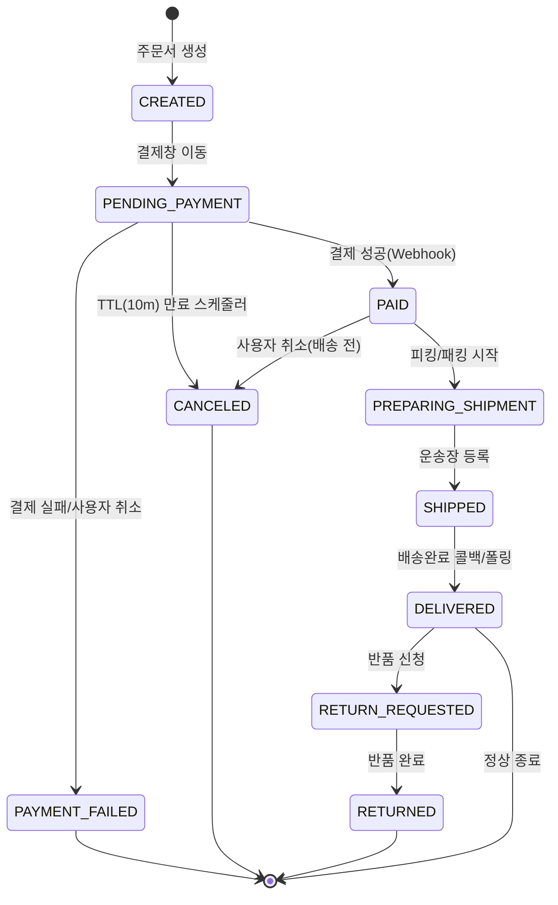

# 상태 다이어그램

### 3.1 주문 상태
- 주문이 생성된 후 결제, 배송을 거쳐 완료되거나 취소/반품되기 까지의 전체 핵심 흐름을 정의한다.

```mermaid
stateDiagram-v2
  [*] --> CREATED: 주문서 생성
  CREATED --> PENDING_PAYMENT: 결제창 이동
  PENDING_PAYMENT --> PAID: 결제 성공(Webhook)
  PENDING_PAYMENT --> PAYMENT_FAILED: 결제 실패/사용자 취소
  PENDING_PAYMENT --> CANCELED: TTL(10m) 만료 스케줄러
  
  PAID --> PREPARING_SHIPMENT: 피킹/패킹 시작
  PAID --> CANCELED: 사용자 취소(배송 전)
  
  PREPARING_SHIPMENT --> SHIPPED: 운송장 등록
  SHIPPED --> DELIVERED: 배송완료 콜백/폴링
  
  DELIVERED --> RETURN_REQUESTED: 반품 신청
  RETURN_REQUESTED --> RETURNED: 반품 완료
  
  PAYMENT_FAILED --> [*]
  CANCELED --> [*]
  RETURNED --> [*]
  DELIVERED --> [*]: 정상 종료
```
