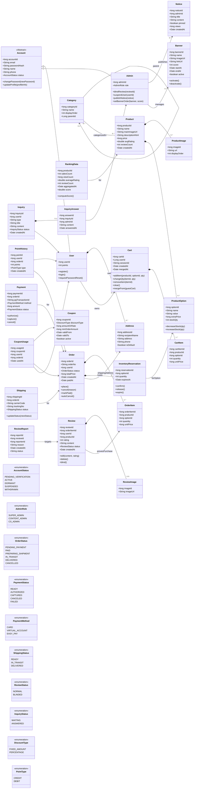

- 생명주기가 함께하는 건 합성(`*--`), 느슨한 포함은 집약(`o--`), 일반 연동은 연관(`-->(단방향)/--(양방향)`), 상속은 `<|-`- 로 모델링

```mermaid
classDiagram
direction LR

class Account {
  <<Abstract>>
  +long accountId
  +String email
  +String passwordHash
  +String name
  +String phone
  +AccountStatus status
  +changePassword(newPassword)
  +updateProfile(profileInfo)
}
class User {
  +long userId
  +int points
  +register()
  +login()
  +requestPasswordReset()
}
class Admin {
  +long adminId
  +AdminRole role
  +blindReview(reviewId)
  +suspendUser(userId)
  +publishNotice(notice)
  +setBannerOrder(banner, score)
}
Account <|-- User
Account <|-- Admin

class Address {
  +long addressId
  +String recipientName
  +String address
  +String phone
  +boolean isDefault
}
User *-- "0..*" Address : owns

class Category {
  +long categoryId
  +String name
  +int displayOrder
  +Long parentId
}
Category --> "0..1" Category : parent

class Product {
  +long productId
  +String name
  +String mainImageUrl
  +String descriptionHtml
  +long price
  +double avgRating
  +int reviewCount
  +Date createdAt
}

class ProductImage {
  +long imageId
  +String url
  +int displayOrder
}

class ProductOption {
  +long optionId
  +String name
  +String value
  +long extraPrice
  +int stockQty
  +decreaseStock(qty)
  +increaseStock(qty)
}

class RankingData {
  +long productId
  +int salesCount
  +long viewCount
  +double averageRating
  +int reviewCount
  +Date aggregatedAt
  +double score
  +computeScore()
}

Product *-- "0..*" ProductImage
Product *-- "0..*" ProductOption
Category "0..*" -- "0..*" Product : categorizedIn
RankingData --> Product : for

class Cart {
  +long cartId
  +Long userId
  +String sessionId
  +Date createdAt
  +Date mergedAt
  +addItem(productId, optionId, qty)
  +changeQty(itemId, qty)
  +removeItem(itemId)
  +clear()
  +mergeFrom(guestCart)
}
class CartItem {
  +long cartItemId
  +long productId
  +long optionId
  +int quantity
  +long unitPrice
}
Cart *-- "1..*" CartItem
User --> "0..1" Cart : owns

class Order {
  +long orderId
  +String orderNo
  +long userId
  +OrderStatus status
  +long totalPrice
  +Date createdAt
  +Date paidAt
  +place()
  +cancel(reason)
  +markPaid()
  +autoCancel()
}
class OrderItem {
  +long orderItemId
  +long productId
  +long optionId
  +int quantity
  +long unitPrice
}
Order *-- "1..*" OrderItem

class InventoryReservation {
  +long reservationId
  +long optionId
  +int quantity
  +Date expiresAt
  +confirm()
  +release()
  +expire()
}
Order *-- "1..*" InventoryReservation : holds
InventoryReservation --> ProductOption : forOption

class Payment {
  +long paymentId
  +long orderId
  +String pgTransactionId
  +PaymentMethod method
  +long amount
  +PaymentStatus status
  +authorize()
  +capture()
  +cancel()
}
Payment --> Order : for

class Shipping {
  +long shippingId
  +long orderId
  +String carrierCode
  +String trackingNo
  +ShippingStatus status
  +updateStatus(newStatus)
}
Shipping --> Order : for

Order --> "1" Address : shippingAddress

class Review {
  +long reviewId
  +long orderItemId
  +long userId
  +long productId
  +int rating
  +String content
  +ReviewStatus status
  +Date createdAt
  +edit(content, rating)
  +delete()
  +blind()
}
class ReviewImage {
  +long imageId
  +String imageUrl
}
class ReviewReport {
  +long reportId
  +long reviewId
  +long reporterId
  +String reason
  +Date createdAt
  +String status
}
Review *-- "0..5" ReviewImage
Review --> OrderItem : provesPurchase
ReviewReport --> Review : targets

class Coupon {
  +long couponId
  +DiscountType discountType
  +long amountOrRate
  +long minOrderAmount
  +Date validFrom
  +Date validTo
  +boolean active
}
class CouponUsage {
  +long usageId
  +long couponId
  +long userId
  +long orderId
  +Date usedAt
}
class PointHistory {
  +long pointId
  +long userId
  +long orderId
  +int points
  +PointType type
  +Date createdAt
}
CouponUsage --> Coupon
CouponUsage --> Order
CouponUsage --> User
PointHistory --> User
PointHistory --> Order

class Inquiry {
  +long inquiryId
  +long userId
  +String type
  +String title
  +String content
  +InquiryStatus status
  +Date createdAt
}
class InquiryAnswer {
  +long answerId
  +long inquiryId
  +long adminId
  +String content
  +Date answeredAt
}
Inquiry *-- "0..1" InquiryAnswer
Inquiry --> User
InquiryAnswer --> Admin

class Notice {
  +long noticeId
  +long adminId
  +String title
  +String content
  +boolean pinned
  +long views
  +Date createdAt
}
class Banner {
  +long bannerId
  +String name
  +String imageUrl
  +String linkUrl
  +int score
  +Date startAt
  +Date endAt
  +boolean active
  +activate()
  +deactivate()
}
Admin --> "0..*" Notice : publishes
Admin --> "0..*" Banner : manages

class AccountStatus {
  <<enumeration>>
  PENDING_VERIFICATION
  ACTIVE
  DORMANT
  SUSPENDED
  WITHDRAWN
}
class AdminRole {
  <<enumeration>>
  SUPER_ADMIN
  CONTENT_ADMIN
  CS_ADMIN
}
class OrderStatus {
  <<enumeration>>
  PENDING_PAYMENT
  PAID
  PREPARING_SHIPMENT
  IN_TRANSIT
  DELIVERED
  CANCELLED
}
class PaymentStatus {
  <<enumeration>>
  READY
  AUTHORIZED
  CAPTURED
  CANCELED
  FAILED
}
class PaymentMethod {
  <<enumeration>>
  CARD
  VIRTUAL_ACCOUNT
  EASY_PAY
}
class ShippingStatus {
  <<enumeration>>
  READY
  IN_TRANSIT
  DELIVERED
}
class ReviewStatus {
  <<enumeration>>
  NORMAL
  BLINDED
}
class InquiryStatus {
  <<enumeration>>
  WAITING
  ANSWERED
}
class DiscountType {
  <<enumeration>>
  FIXED_AMOUNT
  PERCENTAGE
}
class PointType {
  <<enumeration>>
  CREDIT
  DEBIT
}

```